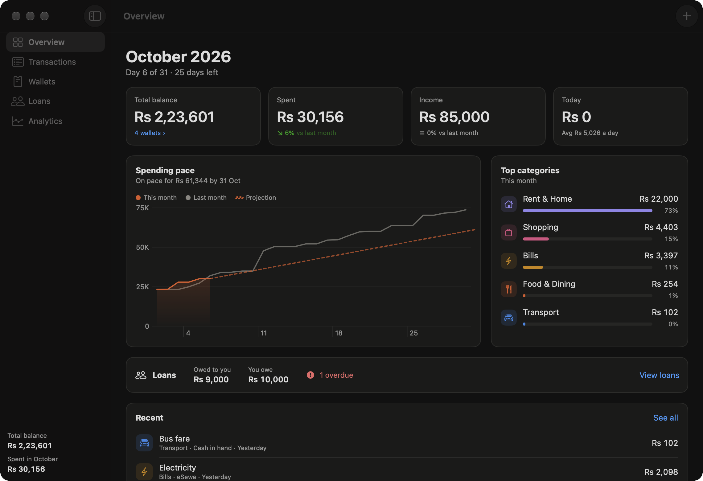
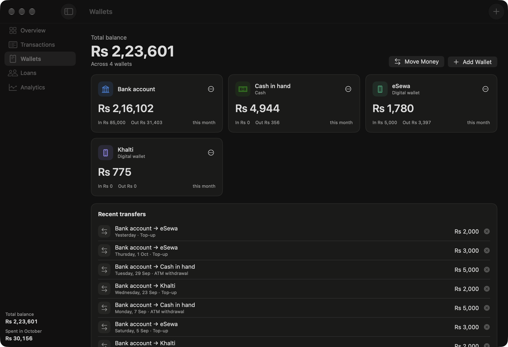
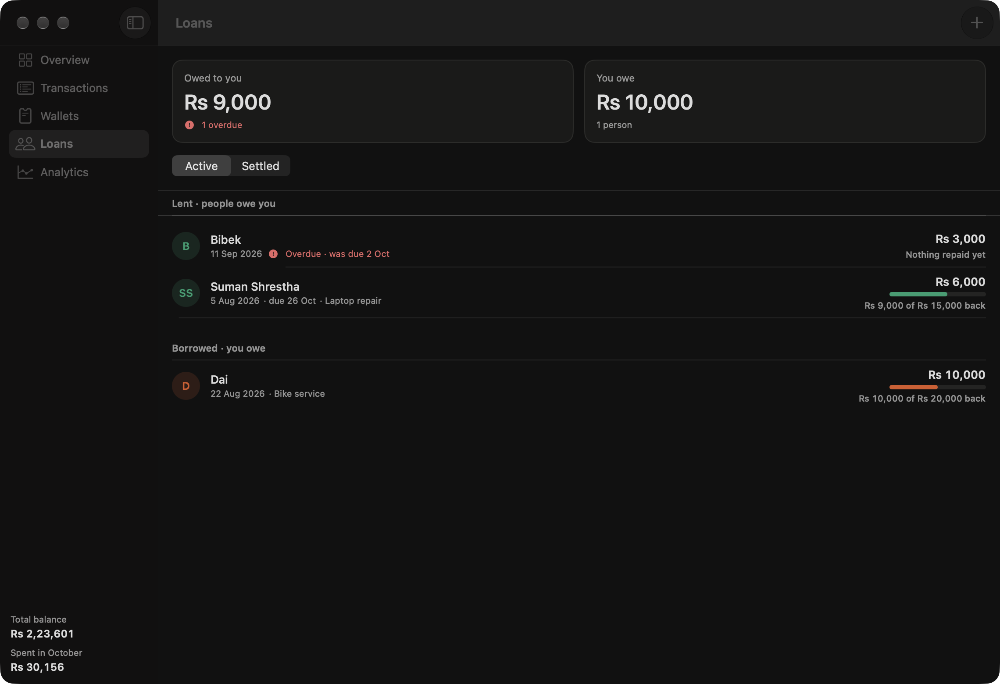
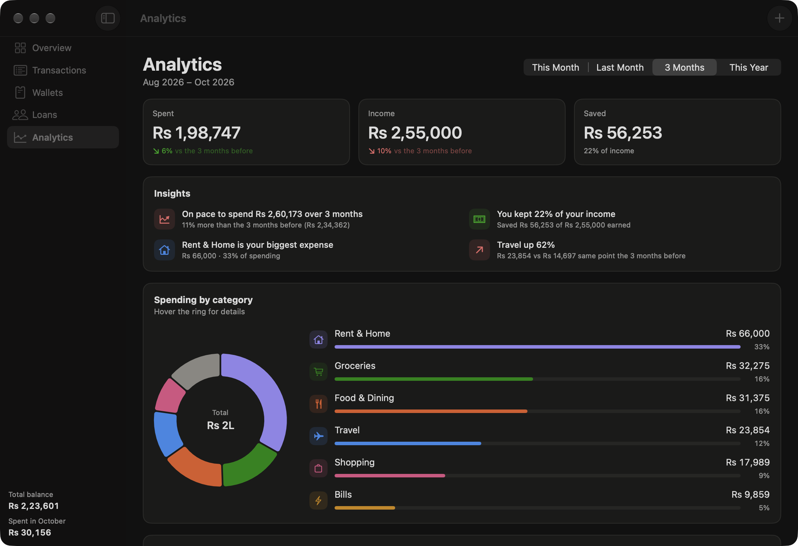
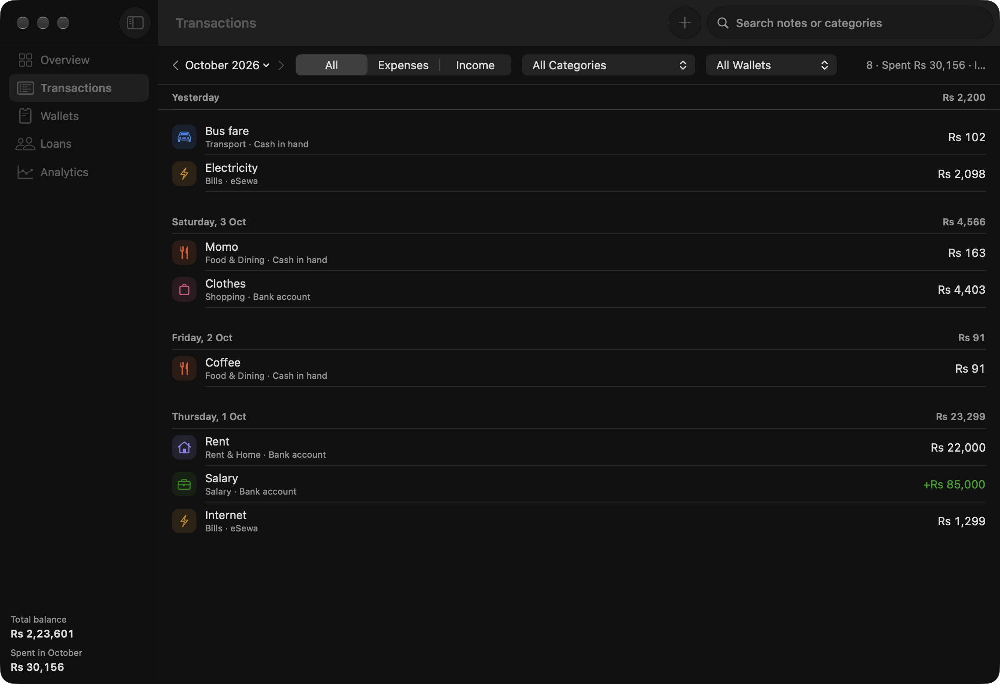

<p align="center">
  
</p>

<h1 align="center">Kharcha · खर्च</h1>

<p align="center">
  <b>The budget tracker made for Nepal.</b> A free, native Mac app.<br>
  आफ्नो खर्चको हिसाब राख्नुहोस्, सजिलै।<br><br>
  Rupees with lakh grouping · eSewa, Khalti, bank and cash wallets · loans to friends · real analytics<br>
  Pure Swift + SwiftUI · no account · no internet · your data never leaves your Mac
</p>

<p align="center">
  <a href="../../releases/latest"><b>Download for Mac</b></a>
</p>

<p align="center">
  
</p>

---

## Why Kharcha?

Most budget apps are built for dollars and credit cards. Kharcha is built for how money moves in Nepal:

- **Nepali Rupees, the way we write them.** Amounts show as **Rs 12,34,567** with lakh and crore grouping, and charts use K, L and Cr.
- **Your real wallets.** Bank account, cash in hand, **eSewa**, **Khalti**, or any you add. Each balance updates as you spend, and **Move Money** handles ATM withdrawals and wallet top-ups without counting them as spending.
- **सापटी (lending), tracked.** Record money you lent to a friend or borrowed from family. Log partial repayments as they come in, set due dates, and see who's overdue.
- **Fast, everyday logging.** Momo for Rs 180 from cash? Three clicks, or straight from the **menu bar**. Notes remember their category, and the amount field adds up `120+80` for you.
- **Private by design.** No sign-up, no cloud, no ads. Everything stays in one file on your Mac.

## Features

<p align="center">
  
  
</p>

- **Overview**: total balance across wallets, this month's spending and income, today's spending, spending pace vs. last month, top categories, recent entries.
- **Wallets**: per-wallet balances, money in and out this month, transfers between wallets, add/rename/recolor your own.
- **Loans**: lent and borrowed, partial repayments into any wallet, due dates, overdue warnings, settled history.
- **Analytics** for this month, last month, 3 months or this year:
  - Spending by category (ring + ranked bars)
  - Daily spending heatmap
  - 12-month income vs. spending trend
  - Insights, including a **month-end forecast** that ignores one-off bills like rent, your savings rate and your biggest changers
- **Menu bar quick-add** with your balance, this month's spending and today's at a glance.
- **Export**: transactions (with wallets and transfers) and loans as CSV for Excel, Numbers or Google Sheets, or a full JSON backup. Nepali text opens correctly in Excel.
- Light and dark mode, keyboard shortcuts throughout, undo for deletes.

<p align="center">
  
  
</p>

## Install

### Download

1. Download `Kharcha-x.y.zip` from the [latest release](../../releases/latest), unzip it, and move **Kharcha.app** to **Applications**.
2. The app isn't notarized by Apple, so macOS blocks the first launch. To allow it, either:
   - Open it once, then go to **System Settings → Privacy & Security** and click **Open Anyway**, or
   - Run this in Terminal:
     ```bash
     xattr -dr com.apple.quarantine /Applications/Kharcha.app
     ```

Works on Apple Silicon and Intel Macs running macOS 14 (Sonoma) or later.

### Build from source

Requires macOS 14+ and Xcode or its command-line tools (Swift 5.9+).

```bash
git clone https://github.com/ayushpandeyy007/Kharcha.git
cd Kharcha
./build.sh install    # builds, copies to /Applications, launches
```

Other options: `./build.sh` only builds into `build/`, and `./build.sh release` also creates a zip for distribution.

## Keyboard shortcuts

| Shortcut | Action |
| --- | --- |
| ⌘N / ⇧⌘N | New expense / new income |
| ⌘L | New loan |
| ⌘T | Move money between wallets |
| ⌘1 – ⌘5 | Overview, Transactions, Wallets, Loans, Analytics |
| ⇧⌘E | Export transactions as CSV |
| ⌫ / ⌘Z | Delete selected / undo |

## Your data

Everything is stored locally in one JSON file at `~/Library/Application Support/Kharcha/data.json`. A backup copy (`data.backup.json`) is refreshed on every launch. Nothing is sent anywhere.

Settings → General has **Show in Finder** and the export buttons. The currency symbol can be changed there too.

## Project layout

| File | Purpose |
| --- | --- |
| `Sources/Models.swift` | Transactions, categories, loans, wallets, transfers, file format |
| `Sources/Store.swift` | Loading, saving, migration, wallet balances |
| `Sources/Analytics.swift` | Periods, totals, forecast and insights |
| `Sources/Charts.swift` | Pace, trend, category ring and heatmap charts |
| `Sources/*View.swift` | Overview, Transactions, Wallets, Loans, Analytics, Settings, menu bar |
| `Sources/EntryForm.swift` | Add/edit form shared by the window and the menu bar |
| `Sources/Export.swift` | CSV and backup export |
| `scripts/make_icon.swift` | Renders the app icon |
| `scripts/demo-data/` | Generates sample data (`KHARCHA_DATA_DIR=<dir>` points the app at it). The screenshots use this. |
| `build.sh` | Compiles a universal, ad-hoc signed `.app` bundle |

eSewa and Khalti are trademarks of their respective owners. Kharcha is an independent app and isn't affiliated with them; it simply lets you keep track of what's in those wallets.

## License

[MIT](LICENSE)
